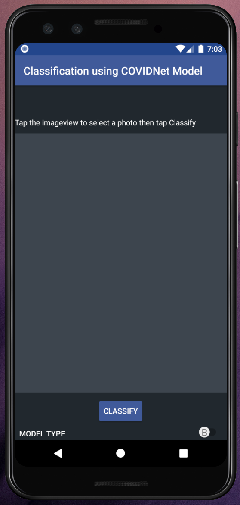

# Covid Mobile Classifier App
## CovidNet TFLite Model Android Mobile Classifier Implementation

  

A (poc) android application to classify COVID-19, Pneumonia or Normal chest X-Rays.

__WARNING: Regardless of accuracy, do not use this application as a method of self-diagnosis. Please visit a doctor for an official diagnosis.__

  

API 26 - Oreo

#### For best results
Utilise a scan of an X-Ray photo. Any anomalies or foreign objects in the photo that is not part of the X-Ray will skew the accuracy of the results.

Both Model A and Model B have been trained to identifiy: Pneumonia, COVID-19 and Normal Lungs X Ray.

The models used in this application can be found at my other repo:
https://github.com/DannyFGitHub/pneumoCheck-Models-TFLite-COVID-Net

### TFLite Version for mobile - COVIDNet Chest X-Ray Classification

_Converted the CXR4 models A and B to TFLite default Optimisation._

|  Type  | Input Resolution | COVID-19 Sensitivity | Optimisation | Size |       Model      |
|:------:|:----------------:|:--------------------:|:------------:|:----:|:----------------:|
| ModelA |      480x480     |         95.0         |   Default    |  40M | [covidnet_a.tflite](https://drive.google.com/file/d/1_DWDkJgFnP_EtvWMMA4FdZBvxLj48T-y/view?usp=sharing)|
| ModelB |      480x480     |         93.0         |   Default    |  12M | [covidnet_b.tflite](https://drive.google.com/file/d/1lUQfmPN1KLXBkGfmPUejFCsAP10zWqkQ/view?usp=sharing)|

 

These models were converted from the following checkpoint / unfrozen graph models:

 

#### ORIGINAL COVIDNet Chest X-Ray Classification
|  Type  | Input Resolution | COVID-19 Sensitivity | Accuracy | # Params (M) | MACs (G) |        Model        |
|:------:|:----------------:|:--------------------:|:--------:|:------------:|:--------:|:-------------------:|
| ModelA |      480x480     |         95.0         |   94.3   |      40.2    |  23.63   |[COVIDNet-CXR4-A](https://bit.ly/COVIDNet-CXR4-A)|
| ModelB |      480x480     |         93.0         |   93.7   |      11.7    |   7.50   |[COVIDNet-CXR4-B](https://bit.ly/COVIDNet-CXR4-B)|

  

